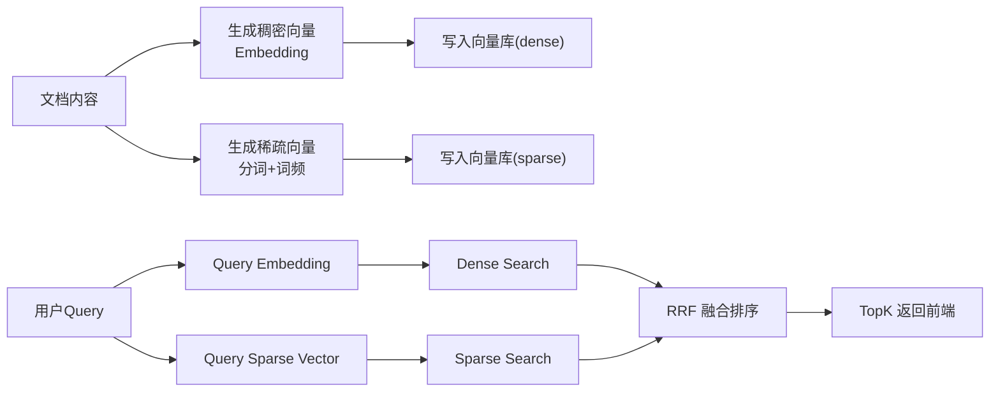

# AI Agent开发之向量检索：一篇讲清「稀疏 + 稠密 + Hybrid Search」怎么落地


## 核心结论

在 AI 搜索和知识库场景中，混合检索（Hybrid Search）是当前最优解：

- **稠密向量（Dense）**：擅长处理语义相似的查询，能够理解同义词、口语化表达
- **稀疏向量（Sparse）**：擅长精确匹配关键词，如产品名称、接口名、错误码等专有术语
- **混合检索（Hybrid）**：通过 RRF（Reciprocal Rank Fusion）算法融合两者优势，在生产环境中表现最稳定

单独使用稠密向量会导致专有名词召回不准确，而仅使用稀疏向量则无法理解语义相近的不同表述。混合检索能够同时规避这两个问题。

## 应用场景与痛点分析

### 典型应用场景

混合检索方案特别适用于以下前端场景：

- **站内搜索**：用户使用自然语言或关键词检索站内内容
- **帮助中心问答**：智能匹配用户问题与知识库文档
- **聊天助手上下文召回**：为 AI 助手提供相关上下文信息

### 单一检索方案的局限性

**仅使用稠密向量检索时的问题：**

- 专有名词召回不稳定：如 "ERR_CONNECTION_RESET" 等错误码可能无法准确匹配
- 短查询偏移：当用户输入 2~6 个词的短查询时，容易产生语义偏移

**仅使用 BM25/关键词检索时的问题：**

- 语义理解缺失："登录失败" 和 "无法完成认证" 虽然语义相近，但因关键词不同导致召回效果差

## 技术架构



## 稀疏向量与稠密向量的本质区别

### 稀疏向量（Sparse）

- 来源：分词 + 词频（TF），可叠加 IDF/BM25
- 特征：高维稀疏（大部分是 0）
- 长处：关键词强匹配、可解释

示例文本：`我是好学生，每天8点起床`

分词后：

```text
["我", "是", "好", "学生", "每天", "8", "点", "起床"]
```

稀疏结构（示意）：

```ts
{
  indices: [102, 1552, 30091],
  values: [1, 1, 1]
}
```

### 稠密向量（Dense）

- 来源：Embedding 模型（如 `text-embedding-3-small`）
- 特征：低维连续浮点向量
- 长处：语义理解强（能懂同义改写）

## 核心实现

以下代码采用通用写法，不依赖特定项目结构，可直接迁移到任意 TypeScript 项目中

### 文档入库：双向量写入策略

```ts
async function addDocument(content: string, metadata?: Record<string, any>) {
  const dense = await embedText(content) // number[]
  const sparse = textToSparseVector(content) // { indices, values }

  await qdrant.upsert('documents', {
    points: [
      {
        id: crypto.randomUUID(),
        vector: {
          dense,
          bm25: sparse,
        },
        payload: { content, metadata },
      },
    ],
  })
}
```

### 稀疏向量生成：分词 + 哈希 + 词频统计

```ts
import { createRequire } from 'node:module'
import { Jieba } from '@node-rs/jieba'

type SparseVector = { indices: number[]; values: number[] }

const require = createRequire(import.meta.url)
const { dict } = require('@node-rs/jieba/dict') as { dict: Uint8Array }
const jieba = Jieba.withDict(dict)

function fnv1aHash(str: string): number {
  let hash = 0x811c9dc5
  for (let i = 0; i < str.length; i++) {
    hash ^= str.charCodeAt(i)
    hash = Math.imul(hash, 0x01000193)
  }
  return hash >>> 0
}

function textToSparseVector(text: string): SparseVector {
  const tokens = jieba
    .cutForSearch(text, true)
    .map((t) => t.trim().toLowerCase())
    .filter(Boolean)
    .filter((t) => !/^[\p{P}\p{S}\p{Z}]+$/u.test(t))

  const tf = new Map<number, number>()
  for (const token of tokens) {
    const idx = fnv1aHash(token)
    tf.set(idx, (tf.get(idx) ?? 0) + 1)
  }

  const entries = [...tf.entries()].sort((a, b) => a[0] - b[0])
  return {
    indices: entries.map(([i]) => i),
    values: entries.map(([, v]) => v),
  }
}
```

### 向量数据库配置：双向量索引声明

```ts
await qdrant.createCollection('documents', {
  vectors: {
    dense: { size: 512, distance: 'Cosine' },
  },
  sparse_vectors: {
    bm25: { modifier: 'idf' },
  },
})
```

说明：

- 稀疏向量通常先传 TF（词频）
- IDF 在向量库侧处理（这里是 `modifier: 'idf'`）

### 查询实现：三种检索模式

```ts
type SearchMode = 'dense' | 'sparse' | 'hybrid'

async function search(query: string, topK = 5, mode: SearchMode = 'hybrid') {
  const querySparse = textToSparseVector(query)
  const queryDense = mode === 'sparse' ? null : await embedText(query)

  if (mode === 'dense') return searchDense(queryDense!, topK)
  if (mode === 'sparse') return searchSparse(querySparse, topK)

  const [denseRes, sparseRes] = await Promise.all([
    searchDense(queryDense!, topK),
    searchSparse(querySparse, topK),
  ])
  return fuseByRRF(denseRes, sparseRes, topK)
}
```

### RRF 融合算法：工程化的最佳选择

```ts
const RRF_K = 60
const rrf = (rank: number) => 1 / (RRF_K + rank + 1)
```

RRF（Reciprocal Rank Fusion）算法的核心思想是基于排名而非分数进行融合。当同一文档在稠密检索和稀疏检索的结果中排名都靠前时，其最终融合分数会更高。

相比于传统的加权融合方法，RRF 的优势在于：

- 无需手动调整稠密向量和稀疏向量的权重比例
- 对不同业务场景的适应性更强
- 实现简单且效果稳定

## 实施路径

基于上述技术方案，完整的实施流程包括以下步骤：

1. **选择 Embedding 模型**：初期可选择 512 维的轻量级模型，平衡性能与成本
2. **实现双向量生成**：在文本入库时同时生成稠密向量和稀疏向量
3. **配置向量数据库**：创建包含 `vectors` 和 `sparse_vectors` 的集合
4. **实现混合检索**：搜索接口默认使用 `hybrid` 模式
5. **提供模式切换**：为前端提供检索模式切换能力，支持关键词优先场景（`sparse` 模式）

## 常见问题与最佳实践

### 稀疏查询向量为空的处理

当查询文本全是标点符号或停用词时，稀疏向量可能为空。此时应返回空数组或降级到纯稠密检索，避免出现异常。

### 稠密向量的必要性检查

在稠密检索分支中，必须确保 embedding 已成功生成。空向量应直接抛出错误，而非静默返回不可靠的结果。

### 向量维度变更与数据迁移

当 embedding 模型的向量维度发生变化（如从 512 维升级到 1536 维）时，现有的向量集合通常无法直接复用，需要重新生成所有文档的向量并迁移数据。

### 中文分词词典的重要性

业务专有术语如果未被包含在分词词典中，会显著影响稀疏向量的召回效果。建议根据业务场景定制分词词典，加入领域特定术语。

## 总结

混合检索方案将向量检索技术从算法研究转化为可落地的搜索体验工程实践：

- **稠密向量**负责语义理解，解决同义词和口语化表达问题
- **稀疏向量**负责关键词精确匹配，确保专有名词召回准确性
- **混合检索**通过 RRF 算法融合两者优势，保证生产环境的稳定性
